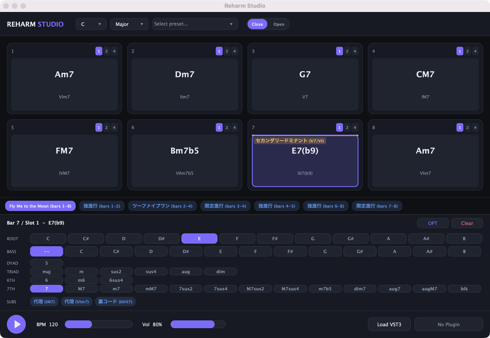

# Reharm Studio

音楽理論に基づいたコード進行を生成し、VST3プラグインで音を確認できるmacOSデスクトップアプリケーション。



## 機能

### ステップシーケンサー

- 最大 8 小節のコード進行を表示・編集・再生
- 1 小節 = 基本 1 コード。小節ごとに **1 / 2 / 4 分割** を切替可能
- セルをクリックしてコードエディタで編集: ルート 12 音 / オンコード /
  23 種のコードクオリティを 2 和音・3 和音・6th・7th のグループで選択
  （5 / maj, m, sus2, sus4, aug, dim / 6, m6, 6sus4 /
  7, M7, m7, mM7, 7sus2, 7sus4, M7sus2, M7sus4, m7b5, dim7, aug7, augM7, blk）
- **OPT** ボタンで omit（omit3 / omit5 / omit7）・5 度変化（b5 / #5）・
  テンション（b9, 9, #9, 11, #11, b13, 13）を付加。衝突しない組み合わせは複数選択でき、
  音楽理論上不可能な組み合わせは選択不可
- コードネームは通称表記を優先（Fadd9, F9, C13, CM11 など。通称がないものは
  C7(b9,13) や C(omit5) の形式）し、ディグリーネームを常に併記
- **クローズ / オープンボイシング** の切替
- 再生中のセルをリアルタイムハイライト

### 代表進行プリセット

王道進行・カノン進行・ポップパンク進行・小室進行・丸サ進行・枯葉進行・
Fly Me to the Moon を現在のキーに移調して一括適用。

### ハーモニー解析 (HarmonyAnalyzer)

- パターン検出: ツーファイブワン・強進行・限定進行・クリシェ・代表進行との一致
- ノンダイアトニックコードの技法分類をセル上にバッジ表示:
  セカンダリードミナント / ドッペルドミナント / 裏コード /
  サブドミナントマイナー / モーダルインターチェンジ /
  パッシングディミニッシュ / ピカルディ終止 / リレイテッドツーマイナー
- コードの置き換え候補（代理コード・裏コード・ドミナント化）をワンクリックで適用

### VST3 ホスト

- VST3 インストゥルメントプラグインの音色でコード進行を再生

## 使用方法

1. アプリケーションを起動する
2. **Load VST3** ボタンで VST3 プラグイン（`.vst3`）を選択する
3. プラグイン名ボタンをクリックすると、プラグインの GUI エディタが開く
4. ヘッダーでキー / スケール / プリセット進行を選択する
5. セルをクリックしてコードを編集する（**OPT** ボタンで omit / テンションを追加）
6. 丸い再生ボタンで再生 / 停止

## トラブルシューティング

### 起動時にセキュリティ警告が出る場合
「"Reharm Studio.app"は開いていません Appleは,"Reharm Studio.app"にMacに損害を与えたり、プライバシーを侵害する可能性のあるマルウェアが含まれていないことを検証できませんでした」などの警告が表示されることがあります。これはアプリが Apple による有料の署名を受けていないために発生します。

**対処方法 (macOS 15 Sequoia 以降):**
1. アプリをダブルクリックして起動し、警告ダイアログが表示されたら「完了」または「キャンセル」を押して閉じます。
2. **「システム設定」** → **「プライバシーとセキュリティ」** を開きます。
3. 右側の画面を一番下までスクロールし、「セキュリティ」セクションにある **「"Reharm Studio.app" がブロックされました」** の横の **「このまま開く」** ボタンをクリックします。
4. 確認ダイアログで再度 **「このまま開く」** をクリックし、パスワードまたは Touch ID で認証してください。

一度この操作を行えば、次回以降は通常通りに起動できます。

### 「アプリは壊れているため開けません」と表示される場合
「"Reharm Studio.app"は壊れているため開けません」と表示される場合は、以下のコマンドをターミナルで実行してください：

```bash
xattr -d com.apple.quarantine /Applications/Reharm\ Studio.app
```

## プロジェクト構造

```
.
├── Source/                          # 本体アプリケーションのソースコード
│   ├── Main.cpp                     # エントリポイント
│   ├── MainComponent.*              # 画面全体の統合・プラグイン読み込み・再生制御
│   ├── AudioEngine.*                # リアルタイム音声処理・可変長スロットのMIDIスケジューリング・VST3 ホスト・HostPlayHead
│   ├── ChordModel.*                 # コード理論コア（23種のコードクオリティ・omit/addオプション・命名・ディグリー・ボイシング）
│   ├── ProgressionModel.*           # 8小節×1/2/4分割のシーケンサーモデル・代表進行プリセット
│   ├── HarmonyAnalyzer.*            # パターン検出・ノンダイアトニック分類・置換候補
│   ├── Theme.*                      # Studio Noir デザインシステム（LookAndFeel・パレット）
│   ├── HeaderBar.* / SequencerView.* / AnalysisStrip.* / ChordEditorPanel.* / TransportBar.*  # UIコンポーネント
│   └── Localization.h               # UI日本語表示（UTF-8安全な変換層）
├── Tests/                           # 単体テスト
│   ├── TestRunner.cpp               # テストランナー
│   ├── AudioEngineTest.cpp          # AudioEngine の動作テスト（可変長スロット含む）
│   ├── ChordModelTest.cpp           # コード理論コア・ボイシングのテスト
│   ├── ProgressionModelTest.cpp     # シーケンサーモデル・プリセットのテスト
│   ├── HarmonyAnalyzerTest.cpp      # ハーモニー解析のテスト
│   └── TimingTest.cpp               # タイミング計算テスト
├── Experiments/                     # 実験的なプログラム（仕様確認・動作検証用）
│   ├── PluginLoadTest.cpp           # VST3 プラグインのチャンネル構成検証（VPS Avenger 用）
│   └── PresetSwitchTest.cpp         # プリセット切替・プレイヘッド・エディタ表示の統合テスト
├── docs/                            # ドキュメント用アセット（スクリーンショット等）
├── CMakeLists.txt
└── CMakePresets.json
```

## ビルド方法

### 標準手順（推奨）: make

正規のビルドディレクトリは `build/` のみです。迷ったら `make` を実行すると使い方が表示されます。

```bash
make                        # 使い方を表示
make app                    # アプリ本体をビルド (build/, Debug)
make test                   # テストを build/ でビルド・実行（正規）
make release-check          # リリース前の最終テスト（唯一の正式検証）
make agent-test AGENT=codex # エージェント用サンドボックス (.agent-builds/codex)
```

`build/` 以外（エージェント用サンドボックス等）で実行したテストの出力には
`[AGENT SANDBOX BUILD]` の印が自動で付き、リリース検証としてはカウントされません。

### 前提条件

- macOS
- Xcode (Command Line Tools)
- CMake 3.15 以上
- Homebrew（CMake インストール用）

### ビルドターゲット

| ターゲット | オプション | 説明 |
|---|---|---|
| ReharmStudio | 常にビルド | メインアプリケーション |
| ReharmStudioTests | `BUILD_TESTS=ON` | テストスイート |
| PluginLoadTest | `BUILD_EXPERIMENTS=ON` | VST3 チャンネル構成検証プログラム |
| PresetSwitchTest | `BUILD_EXPERIMENTS=ON` | プリセット切替統合テストプログラム |

### ビルドモード

| モード | `CMAKE_BUILD_TYPE` | 用途 |
|---|---|---|
| Debug（デフォルト） | `Debug` | 開発・デバッグ（`REHARM_DEBUG_LOG` 有効） |
| Release | `Release` | リリース前の最終確認 |

### CMake Presets によるビルド（推奨）

```bash
# リポジトリをクローン
git clone https://github.com/maniax-jp/reharm-studio.git
cd reharm-studio

# 本体のDebugビルド（デフォルト）
# ※ JUCE 8.0.14 は CMake 構成時に FetchContent で自動取得されます
cmake --preset default
cmake --build --preset default
```

ビルド成果物（Debug）:

```
build/ReharmStudio_artefacts/Debug/Reharm Studio.app
```

### 利用可能なプリセット

| プリセット名 | 内容 |
|---|---|
| `default` | 本体のみ（Debug） |
| `debug-tests` | 本体 + テスト（Debug） |
| `debug-experiments` | 本体 + 実験プログラム（Debug） |
| `debug-all` | 全てをビルド（Debug） |
| `release` | 本体のみ（Release / arm64+x86_64 ユニバーサル） |
| `release-all` | 全てをビルド（Release） |
| `agent-codex` | エージェント用サンドボックス（`.agent-builds/codex`、リリース検証には使えない） |
| `agent-grok` | エージェント用サンドボックス（`.agent-builds/grok`、リリース検証には使えない） |

```bash
# テスト付きDebugビルド
cmake --preset debug-tests
cmake --build --preset debug-tests

# Releaseビルド（リリース前の最終確認用）
cmake --preset release
cmake --build --preset release
```

### プリセットを使わない場合

```bash
# 通常のDebugビルド（本体のみ）
cmake -B build -DCMAKE_BUILD_TYPE=Debug
cmake --build build --parallel 8

# テストを有効にしてビルド
cmake -B build -DBUILD_TESTS=ON
cmake --build build --parallel 8

# 実験プログラムを有効にしてビルド
cmake -B build -DBUILD_EXPERIMENTS=ON
cmake --build build --target PluginLoadTest
cmake --build build --target PresetSwitchTest
```

### テストの実行

`make test` が構成・ビルド・実行までを一括で行います（推奨）。手動で実行する場合は
コンソールバイナリを使います:

```bash
./build/ReharmStudioTests_artefacts/Debug/ReharmStudioTests
```

リリース前の最終テストは必ず `make release-check`（= `build/` での実行）で行ってください。
サンドボックス（`.agent-builds/`）でのテスト結果は出力に `[AGENT SANDBOX BUILD]` の印が付き、
最終検証としては無効です。

## 技術仕様

- フレームワーク: JUCE 8.0.14
- 言語: C++17
- プラグイン形式: VST3
- プラットフォーム: macOS
- ビルドシステム: CMake 3.15+

## ライセンス

このプロジェクトは [GNU Affero General Public License v3.0 (AGPLv3)](https://www.gnu.org/licenses/agpl-3.0.html) の下で公開されています。

詳細は [LICENSE](./LICENSE) ファイルを参照してください。
